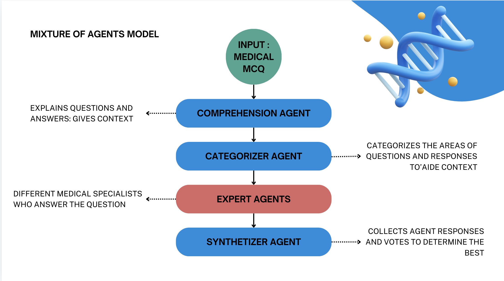
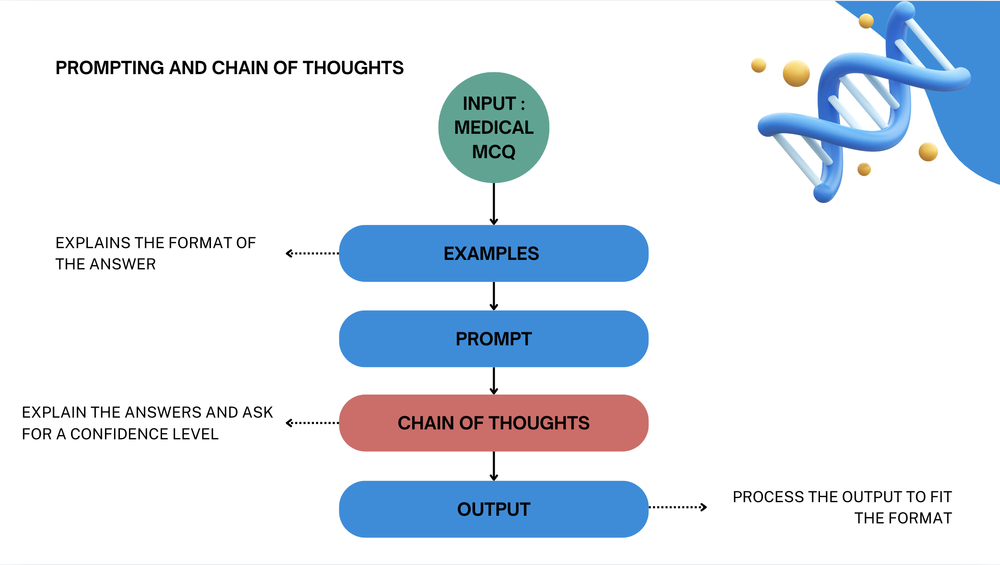

# 

# MISTRAL X ALAN HACKATHON

## 1. Problem Case
Our goal here is to demonstrate how we can inject more medical knowledge into a model (or system!) to improve its ability to answer these questions. We'll use any available open-source resources to achieve this, and we’re excited to see what we can build together—let's see if we can outperform the competition! 😉

We have been provided with 103 questions from an exam for French Medical Practice. Each question presents multiple choices, from A through E, and unlike many other benchmarks, the correct answer can involve multiple choices. This means that any combination of the letters A through E (with 31 possible combinations, combinatorics vibes 😎) could be correct.

Note: We don't have a training dataset with the correct answers—where would the fun be in that? :saluting_face:

The expected format for our submission is a .csv file containing our answers, with the letters for multiple-correct answers being comma-concatenated.

## 2. Solutions
### Mixture of Agents

### Chain of Thoughts

## 3. Challenges
We tried many different approaches as this was the first time we worked on such a problem and lost a lot of precious time. We will learn from this experience for the next hackathons to come and define a solution and focus on it.
